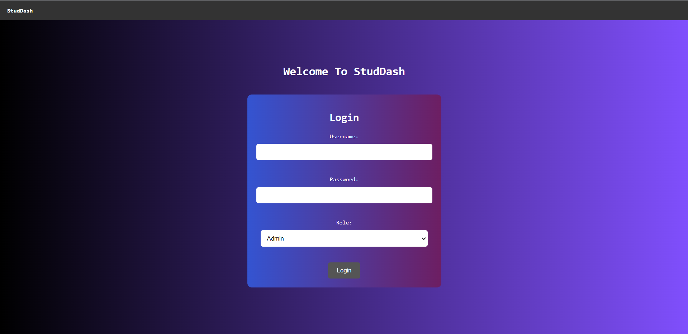
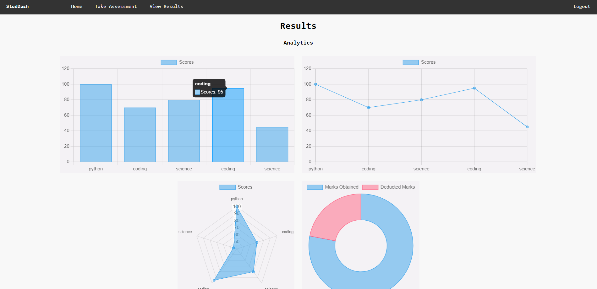
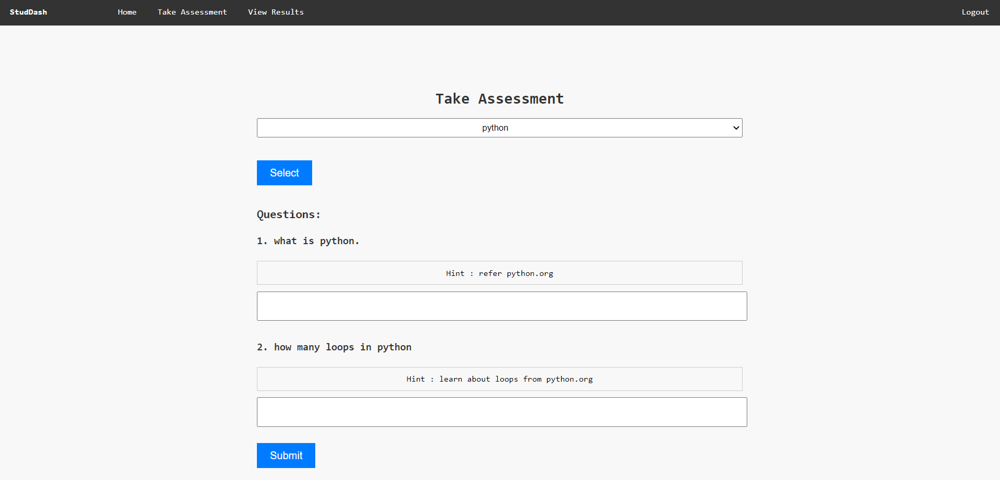
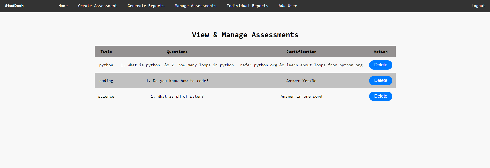

# StudDash (Assessment Management System)

The StudDash is a web application that allows administrators, teachers, and students to manage assessments, track results, and perform various assessment-related tasks. This system provides a user-friendly interface for creating assessments, viewing individual and class reports, and conducting assessments online.

## Technology Specifications

The StudDash (Assessment Management System) is built using the following technologies:

- Python: Programming language used for the backend development.
- Flask: Web framework used to build the application.
- MongoDB: NoSQL database used to store assessment data.
- HTML/CSS: Frontend development languages for creating the user interface.
- JavaScript: Programming language used to add interactivity to the application.
- Jinja2: Templating engine used for rendering dynamic content.

## Temporary Login Details

To access the Assessment Management System, you can use the following temporary login details:

- Admin:
  - Username: owner
  - Password: adminLog

- Teacher:
  - Username: teacher1
  - Password: teacherLog

- Student:
  - Username: student1
  - Password: studentLog

Please note that these are temporary login credentials provided for testing purposes.

## Screenshots

Below are the screenshots of different parts of the Assessment Management System:

1. **Login Page:**

   
   
   This screenshot shows the login page of the application where users can enter their credentials to access the system.

2. **Admin/Teacher Dashboard:**

   
   
   
   These screenshots shows the dashboard for admin and teacher users, offering access to the system's features and options.
   
   **Student Dashboard:**
   
   
   
   This screenshot shows the dashboard for student users, offering access to their assessments and results.

3. **Create Assessment (Admin & Teacher):**

   
   
   This screenshot demonstrates the assessment creation page, allowing admin and teacher users to create new assessments.

4. **View Results:**

   
   
   
   These screenshots showcase the view results page, displaying the assessment results of students in a tabular format.

5. **Generate Reports (Admin & Teacher):**

   
   
   This screenshot presents the generate reports page, where admin and teacher users can generate reports  i.e. Add scores.

6. **Take Assessment (Student):**

   
   
   This screenshot illustrates the take assessment page, enabling student users to take assessments online.

7. **Individual Reports (Admin & Teacher):**

   
   
   This screenshot exhibits the individual reports page, allowing admin and teacher users to view detailed assessment reports for individual students.

8. **Add User (Admin Only):**

   
   
   This screenshot showcases the add user page, providing admin users with the ability to add new users to the system.

9. **View & Manage Assessment (Admin & Teacher):**

   
   
   This screenshot demonstrates the view and manage assessment page, where admin and teacher users can view and manage existing assessments.

Please click on the respective screenshot links to view them in full size.

## How to Run the Application

To run the Assessment Management System on your local machine, follow the steps below:

1. Make sure you have Python and MongoDB installed on your system.
2. Clone this repository: `git clone https://github.com/your-username/assessment-management-system.git`
3. Navigate to the project directory: `cd assessment-management-system`
4. Install the required dependencies: `pip install -r requirements.txt`
5. Set up the MongoDB connection by creating a database with required collections on mongoDB Atlas.
6. Run the application: `python app.py`
7. Open your web browser and access the application at: `http://localhost:5000`

Make sure to replace `your-username` with your actual GitHub username in step 2.

That's it! You should now be able to access and use the StudDash on your local machine.
